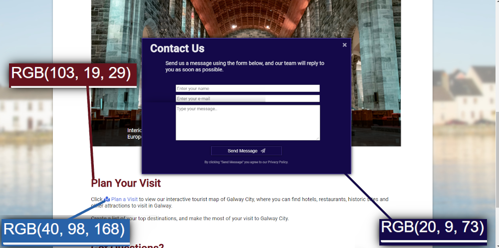
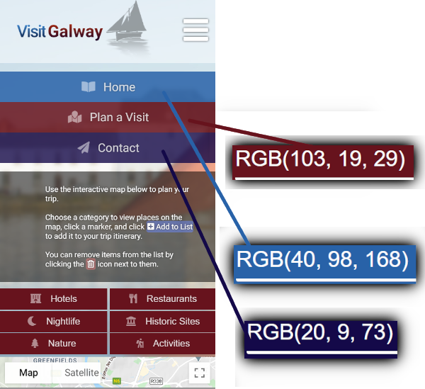
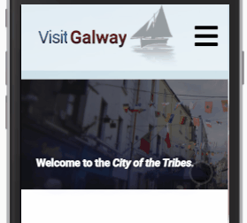

# Interactive Tourist Map of Galway, Ireland

## Overview

VisitGalway is a tourist information website designed to help visitors navigate Galway City & surrounding areas, and help them to find locations to visit that are of interest to them.
The website's homepage includes site navigation, introductory information about the locality of Galway and an image carousel designed to showcase features of the city.

The main functionality of the site is an interactive map which displays places of interest by category, such as hotels, restaurants, historic sites and natural attractions. This map can be accessed by clicking the "*Plan a Visit*" link in the site navigation.
Users can select a category to view places ("*markers*") on the map, belong to that category. When a marker is clicked, an *info-window* is displayed to the user showing the marker's name, basic information, a website link related to the marker, and an "*Add to List*" button. Users can click "Add to List" to add the marker to their trip itenirary ("*Saved Places*"), visible to the right of the map or to the bottom on mobile devices. The purpose of Saved Places is to allow users to create a list of places that they intend to visit.

The website also features a *Contact* form which users can fill out and submit which triggers an e-mail to be sent to the webmaster inbox. The form contains fields for the user's *name, e-mail address* and their *message.*

# UX

## Developer Goals

* Create an informative, easy-to-use interface to attract tourists and visitors to Galway
* Provide users with information about the locality and promote it as a tourist destination
* Assist visitors to Galway in navigating the city
* Promote local business and attractions by providing them with online exposure
* Allow users to get in contact with the Visit Galway tourist information team to ask them questions
* Provide links to social media accounts run by Visit Galway for users to follow for current news and media related to tourism in Galway

## User Stories

1. As a user, I want to learn about Galway city as a tourist destination and why I should go there.
2. As a user, I want to see pictures of Galway that will give me a sense of what the city is like to visit.
3. As a user, I want to be able to navigate the whole website easily and quickly whether I am using it on my laptop, phone, or tablet device.
4. As a user, I want to submit a message to the company behind the website, know that my message has been received, and will receive a reply.
5. As a user, I want to find the company's social media platforms to follow and share with my friends.
6. As a user, I want to see a map of Galway that can give me an orientation of the place as a visitor.
7. As a user, I want to find hotels / restaurants / nightlife / historic sites / nature / activities in Galway that are worth visiting so I can make the most of my trip.
8. As a user, I want to visit the website of a place in Galway that I'm interested in going to, to learn more about it. 
9. As a user, I want an simple, easy way to remember which places I have decided to visit on my trip to Galway.

### How does this website function to meet the needs of the user as described in the User Stories?

1. The website provides a concise and helpful description of Galway city, emphasising its qualities as a tourist destination. This is presented to the user on the "Home" page, designed as the first page of the website that the user will see upon visiting.
2. The website provides a slideshow of images on the *Home* page which emphasise historical sites and cultural scenery around Galway. Captions beneath the image give insight to the images, further assisting the user in meeting the need described in User Story 1. The slideshow will automatically rotate images and their captions at set intervals. Users can navigate between images using "Previous" and "Next" buttons which are displayed on mouseover.
3. The website has been designed to be visually appealing, with simple lines and a vibrant, consistent colour scheme. The website is designed to be coherent and well-organized at all times. The website header logo and navigation are distinct from the main content of the page. The website is fully responsive, and scales in a practical manner to the user's screen size. The site navigation can be accessed by the user at any time on the top of each page. On mobile devices, to ensure optimal use of screen real estate and avoid unnecessary scrolling, a toggle-enabled navigation menu is used. The menu is hidden by default as is standard convention on mobile websites. The menu can be accessed by clicking the "hamburger" icon (three horizontal lines). The mobile navigation can be hidden by clicking this icon again. This mobile navigation is designed to simplify and de-clutter the interface, while allowing the user to smoothly navigate between each page.
4. The website provides a "Contact Us" form which can be easily accessed by clicking the "Contact" link in the desktop or mobile navigation. The link opens a modal window on the same page containing the *Contact Us* form. The use of a modal window enhances the user's experience as they do not have to click between pages to submit a message, saving them time. The user is instructed to fill out their *name, e-mail address* and a *message*. All fields are required in order for the user to receive a response - if any field is left empty, the form will not submit, and a small notification appears on the modal reminding the user to complete each field. Upon successful submission of the form when *Send Message* is clicked, the form will close, and another modal is opened confirming to the user that their message has been received. This confirmation message automatically disappears after a short period of time.
5. The website provides links to the company's three social media accounts at the bottom of the page in the form of icons of the respective social media platform.
6. The website provides an interactive map of Galway, set with a home point approximately at Eyre Square. This map can be accessed by clicking "Plan A Visit" from the homepage. The map uses Google Maps' JavaScript API, and is easy to navigate by dragging the map to move around it. The map can be zoomed in/out using the buttons on its bottom right, or by holding the Ctrl key and using the mouse scroll-wheel.
7. The website allows users to view points of interest in Galway based on category. On the "Plan A Visit" page, there is a list of *category* buttons to the left of the map (on mobile devices, this list will appear on top of the map). Clicking any of these buttons will load places on the map related to that category.
8. Once markers have been loaded to the map by clicking a category button, the user can click on an individual marker to open that marker's *info-window*. This info window displays basic information about the marker, an "Add to List" button (see point 9 below) as well as a hyperlink to a related website. (This hyperlink will open in a new tab to avoid disrupting the user's experience). 
9. The website features an interactive to-do list ("Saved Places") to which users can use to remember locations they would like to visit on their trip to Galway. This list is displayed to the right of the map, or to the bottom on mobile devices. Once markers have been loaded to the map by clicking a category button, the user can click any marker to open its *info-window*, and click "Add To List" to add the marker to Saved Places as a list item. Items can be deleted from the list by clicking the Delete (trash icon) button once the user has visited the location or changed their mind about doing so.

## Design 

[Click here to view primary wireframes.](https://rorybr1.github.io/Milestone-2/wireframes/wireframes.html)  
[Click here to view early design prototypes with color and images.](https://rorybr1.github.io/Milestone-2/wireframes/early-designs.html)
### Concept & Font Choice
The site is designed to appear clean, professional, and uncomplicated while also appearing vibrant and welcoming.
Clean lines are used throughout and a design choice was made to avoid rounded border-corners on buttons and page divisions.
A single font, *"Roboto"*, is used for the header, site navigation, headings and body content. A design choice was made to avoid 
the use of multiple font families; headers are emphasised by using colour and larger font size.
As the website is aimed to attract tourists, a vibrant background image is used that compliments the main colour scheme of the website.
(See diagram below for further breakdown of the site's colour scheme). The background image has been blurred to ease readability and 
avoid distracting from the main content.
[FontAwesome](https://fontawesome.com/) Icons are used in the site navigation & on the "Plan A Visit" page (on category buttons and the "Saved Places" list, as well as in
the footer (for social media links) to illustrate their meaning.
### Colours
Three main colours are used in throughout the site. 
Burgundy - *rgba(103, 19, 29)*;
Dark Royal Blue - *rgba(40, 98, 168)*;
Deep Purple - *rgba(20, 9, 73)*;
as well as White *rgba(255,255,255)* and Black *rgba(0,0,0)*.
These colours are used with varying opacity throughout the site. See the images below demonstrating the consistent use of these
colours throughout the site.

# Existing Features
The following is a list of the main functionalities of the site, built to fulfill the needs of the user as described in User Stories above.
* ## Site Navigation
 
Desktop navigation bar used to navigate between pages of the site and open the Contact Us modal.
* ## Mobile Site Navigation
  
Toggle-enabled mobile navigation bar used to navigate the site on mobile devices.
* ## Image Slideshow
  
Displayed on homepage allowing users to view images of the area conveniently.
* ## Social Media Links
 
Displayed in footer. When clicked, opens the relevant social media website in a new window. 
This allows users to access more tourist-related content about Galway produced by the web team.
* ## "Contact Us" Modal Window
 
Modal window opened when "Contact" is clicked either on the desktop or mobile navigation.
User is prompted to enter their name, e-mail address, and a message to send to the web team. 
The modal window can be closed by clicking the "X" in the top-right corner of the modal.
  
Error message shown if the user attempts to submit an incomplete form
  
Confirmation message shown when the user successfuly submits the form.
* ## Interactive Tourist Map
  
An interactive map which allows the user to view markers on the map based on categories of their interest. Accessed by clicking "Plan a Visit" on site navigation. Markers can be clicked, showing an info-window with information about the map. An "Add to List" button will add the marker to the "Saved Places" list, which is saved locally. The website can be refreshed or closed, and the list will persist when the user re-visits the page. Items can be deleted from the list by clicking the "Delete" icon next to them.
The map is built using [Google Maps Javascript API](https://developers.google.com/maps/documentation/javascript/overview).
Users can zoom in/out of the map by using the buttons on the bottom right of the map, or by double-clicking with the left and right mouse buttons.

## Developer Notes
* *The list of markers in assets/js/markersData.js must be kept up-to-date by the web team, by adding new markers and removing obsolete markers (for instance, if a restaurant closes or if a new business opens). In the future, this could be automated by loading marker data from an external, up-to-date source if one is found.* 
* As this project was created for educational purposes, the Contact Us form has not been linked to an e-mail account and does not trigger an e-mail to be sent to any mailbox. In the future, this can be done easily using [EmailJS](https://www.emailjs.com/). 

### Future Features
While the primary functionalities of the site have been achieved, additional features could add to the user's experience on the site.
Future developers should consider this list of potential features. 
* An informational video on the homepage to increase the educational value of the website. A visual media professional could be employed to produce a high-quality informational video for the front page of the website. 
* On the "Plan A Visit" section > Interactive Map > "Saved Places" list, functionality could be added so that when a list-item is clicked, the relevant marker and info-window is highlighted on the map. This would enable users to quickly find the location of their Saved Places.
* "Suggested Places to Visit" or similar. A list could be added on either the homepage or the "Plan A Visit" page, which displays suggested locations for the user to discover on the map. The list could be updated with popular locations, or locations which are holding events on the given week. When clicked, list-items open the location's marker on the map, allowing them to save the suggested place to their Saved Places.

# Technologies Used
## Code
* [HTML5](https://www.w3.org/standards/webdesign/htmlcss.html) - Used on all pages for page structure and content.
* [CSS](https://www.w3.org/standards/webdesign/htmlcss.html) - Used on all pages for content styling and placement.
* [JavaScript](https://www.javascript.com/) - Used to enable interactivity of: *Contact Us* modal, *image slideshow* on index.html, *toggle-enabled mobile navigation*, *interactive map* on plan-a-visit.html.
* [jQuery](https://jquery.com/) - JavaScript library used for ease of development in *map,js, todoList.js, toggle.js*.
* [Google Maps JavaScript API](https://developers.google.com/maps/documentation/javascript/overview) - Referenced in plan-a-visit.html and technologies used in assets/js/map.js. Used as basis for the interactive map on plan-a-visit.html.
* [Slideshow](https://codepen.io/learnwebcode/pen/RjpyWd?editors=1100) - Including assets/js/slideshow.js and assets/css/slideshow.css. Used on index.html to enact image slideshow functionality. Code written by [Brad Schiff](https://codepen.io/learnwebcode). Styling edited to fit site needs.

## Editors
* [Visual Studio Code](https://code.visualstudio.com/) - Open-source code editor. Used throughout development to write code.
* [GitPod](https://www.gitpod.io/) - Cloud-based code editor. Workspace-sharing feature used when receiving assistance from [Code Institute](https://codeinstitute.net/) Tutor Support.
* [GIMP Image Editor](https://www.gimp.org/) - Used throughout to crop and edit images.

## Additional Tools
* [Balsamiq](https://balsamiq.com/) - Used to create primary wireframes in the design process.
* [JustInMind](https://www.justinmind.com/) - Used to create more detailed wireframes/prototypes.
* [Responsively](https://responsively.app/) - Used to test site responsiveness throughout development.
* [Am I Responsive](http://ami.responsivedesign.is/) - Browser-based preview any website's responsiveness. Screenshot featured in readme.md as wireframes/header-screenshots.png. 
* [Google Chrome DevTools](https://developers.google.com/web/tools/chrome-devtools) - Used throughout development to view the website, test features, test JavaScript, and test responsiveness. 
* [ScreenToGif](https://www.screentogif.com/) - Used to screen-record and create GIFs of these recordings for the purposes of readme.md and testing.md.

# Credits
## Images
All images were used under license from stock photo websites. | [PixaBay License](https://pixabay.com/service/license/) | [Unsplash License](https://unsplash.com/license)  
Source links are listed below for each image. Some images have been edited and adjusted for use on the site.
* [background.jpg](https://pixabay.com/photos/galway-hookers-2676502/) - coolpropix on PixaBay. 
* [dungaire-castle.jpg](https://pixabay.com/photos/castle-fort-ireland-irish-castle-5748206/) - bluetaichi on PixaBay
* [traditional-boats.jpg](https://pixabay.com/photos/traditional-sailing-boats-galway-2676503/) - coolpropix on PixaBay
* [galway-cathedral.jpg](https://unsplash.com/photos/woCygN0t-KE) - Gabriel Ramos on Unsplash
* [kylemore-abbey.jpg](https://pixabay.com/photos/kylemore-abbey-ireland-castle-4152831/) - UkyoKatayama on Pixabay
* [index-splash.jpg](https://unsplash.com/photos/gsLM7kBkDvw) - Ruby Doan on Unsplash

## Fonts
* [Google Fonts](https://fonts.google.com/specimen/Roboto) - Webfonts service. "Roboto" font used throughout site.
* [FontAwesome](https://fontawesome.com/) - Webfont technology used to display icons in the site navigation buttons, social media links in footer, category buttons on plan-a-visit.html, and anywhere the < i > HTML tag is used. 

# Acknowledgements 
* Special thanks to [Code Institute](https://codeinstitute.net/) Tutor Support who helped me troubleshoot at multiple points in the development of the project.
* Special thanks to my [Code Institute](https://codeinstitute.net/) mentor, Arnold Kyeza, who gave helpful guidance and constructive feedback at multiple points throughout the project. 
* [Javascript Google Maps Api Tutorial](https://www.youtube.com/watch?v=8NUqDc1bQ84) by Framework Television on [YouTube](http://www.youtube.com/) helped me in learning how to use the Google Maps JavaScript API.
* [Beginner Vanilla Javascript Project Tutorial](https://www.youtube.com/watch?v=Ttf3CEsEwMQ) by Dev Ed on [YouTube](http://www.youtube.com/) helped me to build the "Saved Places" functionality on plan-a-visit.html.
