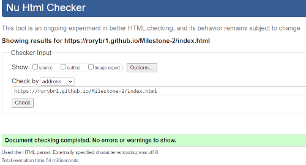
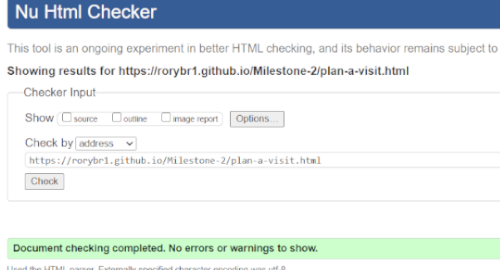
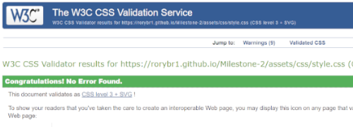
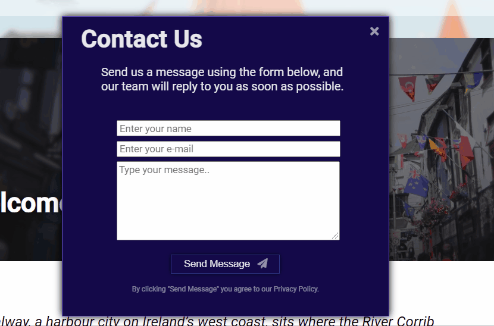
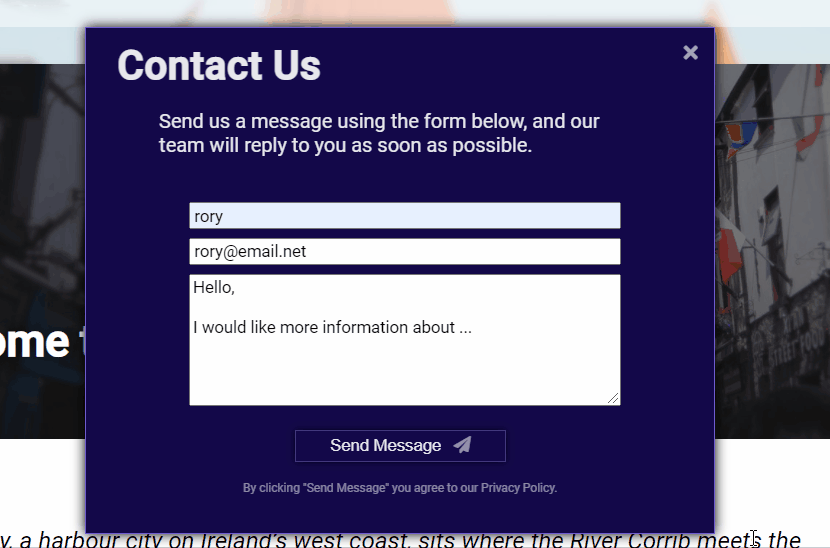

[ 🠔 Back to ReadMe ](../readme.md)

# Testing

## Table of Content 
1. [W3C & JSHint Validation](#html)
    * [Index.html](#Index)
    * [Plan-a-visit.html](#Plan-a-visit)
    * [/assets/css/style.css](#Style)
    * [JavaScript](#JavaScript)
2. [User Stories](#user-stories)
    * 
<hr>
<hr>


## W3C Validation 
### HTML
*index.html* and *plan-a-visit.html* were both put through the [W3C HTML Validator](https://validator.w3.org/)
* ### Index
    The following errors were found and corrected

1.   
    ```
    Error: Bad value 120px for attribute height on element img: Expected a digit but saw p instead.
     From line 31, column 13; to line 31, column 131
     < img src="assets/images/hooker.png" alt="Galway Hooker, type of fishing boat home to Galway." id="hooker" height=120px >↩     
     ```
    "height=120px" corrected to "height=120".

2. 
    ```
    Error: Element a not allowed as child of element ul in this context. (Suppressing further errors from this subtree.)
     From line 49, column 13; to line 49, column 50
     < a href="index.html" class="nav-link" >↩     
    ```

    This same error was found for the "Plan A Visit" and "Contact" links in #mobile-nav. The "Ul" element was changed to a "nav" element.

3.  
    ```
    Error: Bad value for attribute action on element form: Must be non-empty.
     From line 68, column 10; to line 68, column 43
     ↩         < form id="contact-form" action="" >↩    
    ```

    action="" was removed.

4.  
    ```
    Error: Stray end tag i.
     From line 73, column 98; to line 73, column 101
     lane">< /i >< /i >< /butt 
    ```

    The stray < /i > tag was removed.

5. 
    ``` 
    Error: A slash was not immediately followed by >.
     At line 153, column 17
            < br/  >↩      
    ```  

    Several < br/ > tags written incorrectly written with a space before the closing bracket. The spaces were removed.

6. 
    ```
    Error: Stray start tag script.
     From line 159, column 73; to line 159, column 106
     ton): --> <script src="assets/js/toggle.js"></scri 
    ```
    Script tag was outside of < body >. All script tags were moved to within < body >.

7. 
    ```
    Error: Element li not allowed as child of element a in this context. (Suppressing further errors from this subtree.)
    From line 50, column 19; to line 50, column 32
          <li id="home"> <i cl 
    ```
    
    < li > elements were changed to < div > elements.

After these errors were corrected, the HTML passed without error or warning. 



<hr>

* ### Plan-a-visit
The following warning was found

1. 
    ```
    Warning: Consider avoiding viewport values that prevent users from resizing documents.
    rom line 20, column 7; to line 20, column 115
    pt>↩      <meta name="viewport" content="width=device-width; initial-scale=1.0; maximum-scale=1.0; user-scalable=0;" />↩   </
    ```

* A fix was found [here](https://www.webdeveloper.com/d/367195-avoid-validation-warnings-on-meta-viewport/2) and implemented.

    After this was corrected, the HTML passed without error or warning. 

    

<hr>
<hr>

## CSS
All CSS was put through the [W3C CSS Validation Service](https://jigsaw.w3.org/css-validator/).

* ### Style
    
    Located at assets/css/style.css. 
    The following errors were found and corrected.

1. 
    ```
    14  	::selection	Value Error : color none is not a color value : none
    ```

    The line was removed as it was unnecessary. 

2. 
    ```
    62	#visit	text is not a background-clip value : text
    74	#galway	text is not a background-clip value : text
    ```
    These lines were removed to satisfy the validator as they did not affect the rendering of the page.

3. 
    ```
    134	.welcome-text	Value Error : width only 0 can be a unit. You must put a unit after your number : 80
    ```
    This line was removed as it was redundant.

4. 
    ```
    140	.welcome-text	rgb(255, 255, 255, 0.6) is not a box-shadow value : rgb(255, 255, 255, 0.6)
    ```

    This line was removed as it was redundant.

5. 
    ```
    676	#menu-button	0.1 is not a animation-duration value : 0.1
    ```

    The value was corrected to be a unit in seconds.

6. 
    ```
    720	ul	Property padding-inline-start doesn't exist : 0
    ```
    This line was removed as it was redundant.

    After these fixes, the CSS passed the validator without error. 

    

    <hr>

* ### Slideshow.css
    Located at assets/css/slideshow.css.
    The CSS passed the validator without error.
    

<hr>
<hr>

## JavaScript
#### The following files in assets/js/ were passed through [JSHint](https://jshint.com/)

* todoList.js
* toggle.js
* map.js

    Warnings included use of template literals for compatibility reasons. A developer decision was made to continue using template literals as they are supported by most browsers and are common JavaScript developer practice. 
    Warnings about undefined/unused variables are to be ignored; they may be undefined/unused within the context of the individual script, but they are defined/used by an external script. (ie. map.js calls the variable "map", which is not defined within map.js but is used by the external Google Maps JavaScript API.)

<hr>
<hr>

# User Stories

The [User Stories](https://github.com/RoryBr1/Milestone-2/blob/master/readme.md#user-stories) were used as a basis to test the site. 
The Developer followed through each of the User Stories, *on desktop and mobile devices*, and tested the site for functionality while doing so.

1. **As a user, I want to learn about Galway city as a tourist destination and why I should go there.**
        * ✔ On index.html, there is text and images of Galway that are visible on page load.
        * ✔ The navigation bar and body text prompt me to explore the site, and visit the Plan A Visit page.
        * ✔ There is a contact link for me to ask the siteowner questions.

2.  **As a user, I want to see pictures of Galway that will give me a sense of what the city is like to visit.**
        * ✔ On index.html, there is a slideshow of pictures to view.
        * ✔ The pictures are automatically displayed in rotation, for a couple of seconds each.
        * ✔ The "Previous" and "Next" buttons show me the previous and next images in the slideshow respectively.
        * ✔ The caption on the bottom of the slideshow matches the relevant image, and is readable.

3. **As a user, I want to submit a message to the company behind the website, know that my message has been received, and will receive a reply.**
        * ✔ There is a Contact link on the navigation bar at the top of each page that is clearly visible.
        * ✔ When I click the Contact link, the Contact Us form appears conveniently in a modal window.
        * ✔ If I want to close the window, the intuitive "X" button in its top right corner will do so.
        * ✔ The format and purpose of the form fields are clear and intuitive. 
        * ✔ If I try to submit the form without completing it, an error message appears.
        * ✔ Once I have filled the form out correctly, and click "Send Message", the window closes, and a notification is displayed assuring me that my message has been received.
        * ✔ If I click "Contact" again, I can see that the form has been reset since my message was successfully submitted.

    
    
    

4. **As a user, I want to find the company's social media platforms to follow and share with my friends.**
        * ✔ If I scroll to the bottom of the page, there are links to the company's social media websites.
        * ✔ The links, when clicked, open the relevant social media site in a new browser tab so as not to interrupt my experience.

5. **As a user, I want to see a map of Galway that can give me an orientation of the place as a visitor.**
        * ✔ The body text towards the bottom of index.html informs me that I can view this map by clicking "Plan A Visit".
        * ✔ When I click Plan A Visit, the page opens within the same browser window as it should.
        * ✔ The page loads a map centered on Galway city centre.
        * ✔ The map can be zoomed in/out by clicking the "+" or "-" buttons on the map.
        * ✔ The map can be maneuvered by clicking and dragging it.
        * ✔ The map is visually clear and displays the names of localities.
    
6. **As a user, I want to find hotels / restaurants / nightlife / historic sites / nature / activities in Galway that are worth visiting so I can make the most of my trip.**
        * ✔ [While on Plan A Visit] Buttons are displayed to the left (top on mobile devices) of the map, clearly labeled and with icons, which are intuitively linked to the map.
        * ✔ When I click on the *Hotels, Restaurants, Nightlife, Historic Sites, Nature *or* Activities* buttons, marker points are loaded onto the map.
        * ✔ When I click any of the markers, it shows me an info-window displaying information about that marker, which is related to the category of the button that I clicked on.
        * ✔ The info-window has text that is helpful and clear to read.
        * ✔ The info-window has a link to a website that is relevant to the marker I have just clicked.
        * ✔ If I click the link in the info-window, it opens the site in a new browser tab so as not to interrupt my experience.
        * ✔ I can close the info-window by clicking the "x" in the top right corner of it.